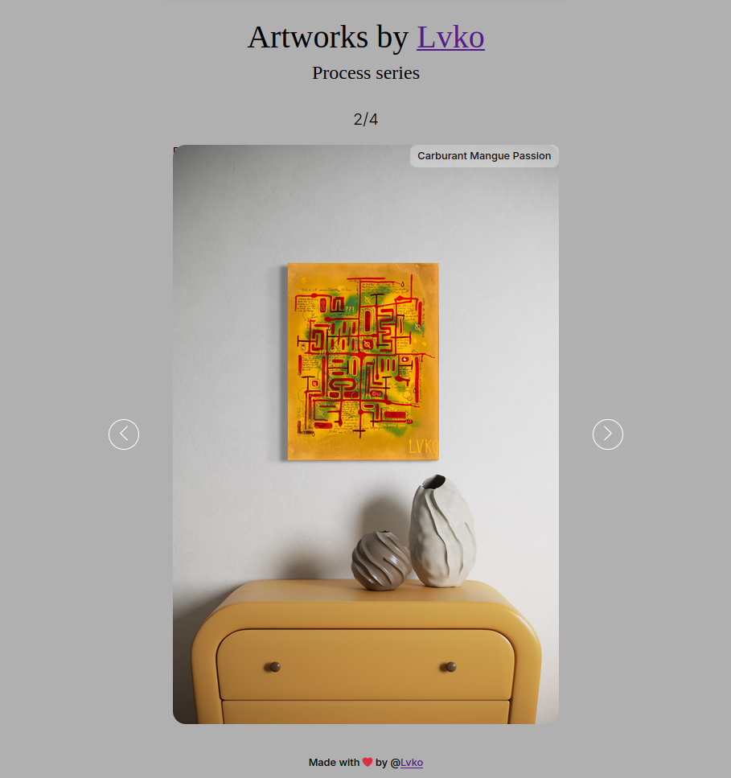

# Slider

J'ai réalisé ce simple slider React avec quelques-unes de mes peintures.

## Œuvres
Il s'agit d'une série de toiles nommée "Process", composée pour l'instant de 4 toiles réalisées en juin 2024. On peut voir le titre en haut à droite. Vous pouvez aussi accéder à mon Instagram en cliquant sur mon pseudo : [Lvko](https://instagram.com/lukomade).

## App
Il s'agissait de mon premier projet React et la mise en place de React a été plus longue que la réalisation du slider, LOL.
Pour lancer en local, il suffit de faire un npm install puis npm run dev.

